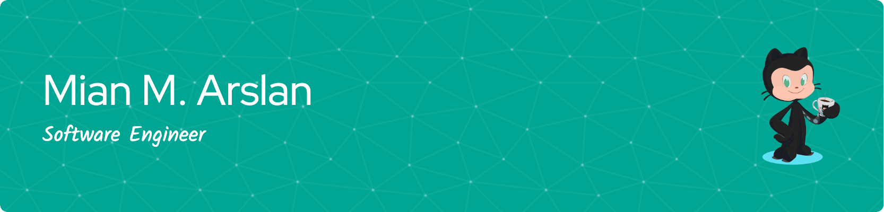

## Hi, I am Arslan :wave: :technologist:

A software engineer with experience in node js, react js, and angular 11+. I love to explore advancement in computer science. I have a passion for developing software that solves real-world problems and enhances people's lives.

## :rocket: Professional Experience

- **iDevNerds**, _Software Engineer_, 2022-Present

  - Requirement Analysis
  - Database Design
  - Deployment
  - Manage Team

- **iDevNerds**, _Associate Software Engineer_, 2021-2022
  - MEAN Stack Development

## 🎓 Education

- BS Software Engineering, The Superior College, Lahore, 2022

## 🏅 Certifications

- AWS Educate Cloud Computing 101 — Trained — Issued: 2025-12
- AWS Educate Getting Started With Storage — Trained — Issued: 2025-12
- AWS Educate Getting Started With Compute — Trained — Issued: 2025-12
- AWS Educate Getting Started With Networking — Trained — Issued: 2025-12
- AWS Educate Getting Started With DataBase — Trained — Issued: 2025-12

## :pen: Languages and Frameworks

## :bulb: Tools

## 💻 Databases and ORMs

## 💻 Projects

- AireHealth: Cloud-based enterprise EHR module is a highly reliable and high-performing system that provides an electronic prescribing system that connects prescribers to pharmacies and a PMS module that provides access and management features to patient demographics, scheduling, and workflow management for the front and back office. It has all the required features to run your practice like scheduling, provider availability, appointment reminders, Copay, balance payments, eligibility, insurance, referrals, user role management, reports, and configuration setting according to the laws based on locations of states.
  It's built on Angular 11, Node JS used Sequelize as ORM with MySQL. Mainly I worked on the EMR module and admin portal.
  A HIPAA-compliant system that follows all standards of the health industry of the USA.
- Taxeezy: The easiest and most cost-effective solution to your tax return. Using the system, the input required can take just a few minutes to file a tax return in the UK. The application platform asks different questions according to your profession and wealth and files the return intelligently.
  It's built on Next js, Node JS used Mongoose as ORM with MongoDB. Mainly I worked on the backend module.

## :incoming_envelope: My GitHub History!

## GitHub & Stats

- Profile: [MianMArslan](https://github.com/MianMArslan)
- Summary: Active open-source contributor focused on backend systems, cloud infra and TypeScript.

## 📧 Contact

- Email: mian.m.arslan@hotmail.com
- LinkedIn: https://www.linkedin.com/in/mian-muhammad-arslan-5aa9191a6/
- Twitter: https://twitter.com/Mian_M_Arslan

⭐️ From arslan with 💖.
